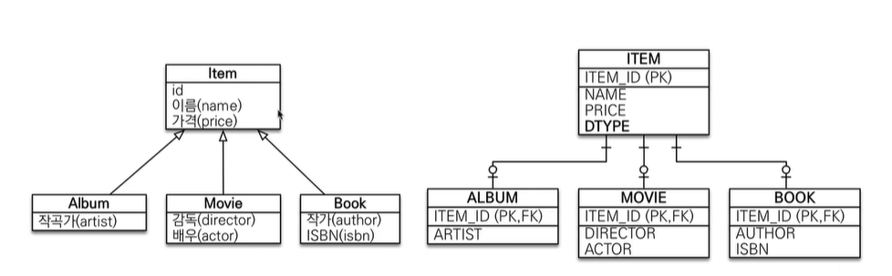
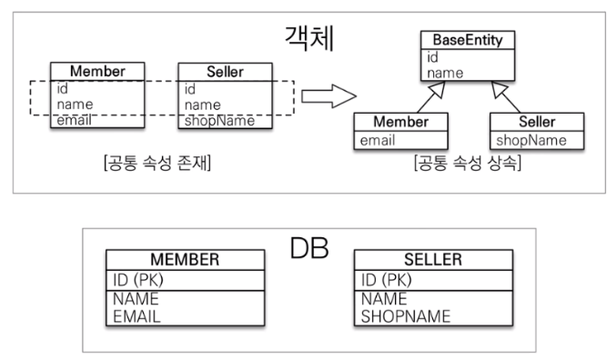

# 연관관계 매핑 기초
---
1. JPA는 모두 트랜잭션 안에서 실행되어야한다.  

### __2. @Entity__
- 기본 생성자 필수(파라미터가 없는 public 또는 protected 생성자)
- final, enum, interface, inner 클래스 사용 x
- 저장할 필드에 final 사용 x  
	
### __3. @ManyToOne (다대일)__  --> 이곳이 다대일 관계 에서 "다"이다.
- 다대일 객체에서는 @ManyToOne과 @JoinColumn(name = "컬럼명") 을 써줘야 한다.
- 객체를 받아온다
	
	ex) Member 와 Team 이라는 객체가 있을때 둘은 다대일 관계라고 하면
		Member 객체 안에서는
```java
@ManyToOne
@JoinColumn(name = "TEAM_ID")
private Team team;
```

### __4. @OneToMany (일대다)__ --> 이곳이 다대일 관계 에서 "일"이다.
- 그럼 일대다에서는 어떻게 받아오는가
- 위에 Member 객체에서 선언한 변수명으로 mappedBy 에 걸어준다.(컬럼명으로 거는거 아니다.)
- new ArrayList는 관례로 초기화해준다.

	ex) 일대다 Team 안에서는
```java
@OneToMany(mappedBy = "team")
List<Member> members = new ArrayList<>();
```

### __5. 연관관계의 주인__
- 양방향 연관관계에서는 둘 중 하나만 외래키를 관리해야 한다.
	(둘다 등록하고 수정할 수 있게 하면 안됨)
- 외래키로 사용하는곳이 주인이다.(다대일 관계에서 "다"가 주인) --> 위에서는 Member 클래스 안에 있는 객체가 주인
- @JoinColumn 사용한곳이 주인이다.(등록, 수정 가능) (DB 업데이트 가능)
-  @ManyToOne 이 주인
- mappedBy 는 연관관계 주인한테 사용 x
	고로 mappedBy 가 사용된것은 읽기만 가능하다.(조회만 가능, 값 넣어도 JPA가 등록, 수정 하지 않는다)
- "다" 쪽이 항상 주인이다.
- 이쪽이 기준!
- 주인한테만 값을 입력하면 DB에 전송되지만 순수한 객체 관계를 고려하면 항상 양쪽 다 값을 입력해야 한다.(테스트 케이스 고려)
	ex) team.getMembers().add(member);
- 근데 위에 코드는 까먹을 가능성이 많으니 Member 클래스에서 setTeam 안에 코드를 넣어주는게 좋다. (연관관계 편의 메소드)

ex 1) Member(주인) 쪽에서 코드를 넣는다면

```java
public void setTeam(Team team){
this.team = team;
team.getMembers().add(this);
}
```	
ex 2) Team 쪽에서 코드를 넣는다면
```java    
public void addMember(Member member){
member.setTeam(this);
members.add(member);
}
```		
ex) 1이나 2 둘 중 하나만 사용

<br>

### __6. 상속관계 매핑__
<br>



- @Entity로 모든 클래스 생성 후 자식 클래스에 extends 로 상속받아서 사용한다.

ex) 
```java
@Entity
public abstract class Item {}
@Entity
public class Album extends Item {}
```

<단잍테이블 전략>
- 위의 코드로 Entity를 생성하여 메인메소드를 실행하면 Item 테이블 안에 모든 컬럼(자식 클래스)가 추가 되어 생성된다.
(기본전략 = singleTable / stratege = InheritanceType.SINGLE_TABLE)
- 자식 테이블이 따로 생성 안되고 모두 부모 테이블 한곳에 추가 되기 때문에 구분할 수 있도록 @DiscriminatorColumn 을 작성하지 않아도 자동으로 "DTYPE" 컬럼을 생성해준다.

<조인전략>
- 부모(Item) 클래스에 @Inheritance 어노테이션을 붙여주면 내가 작성한 클래스대로 테이블이 생성된다.
- @DiscriminatorColumn 을 작성하면 "DTYPE" 이라는 컬럼이 생성되며 어디서 추가 되었는지 알 수 있도록 자식의 엔티티명이 들어가게 된다 (ex. Movie, Album, Book)
- 자식 클래스에는 @DiscriminatorValue("원하는값") 을 작성하면 부모 테이블 DTYPE 에 insert 되는 값이 내가 원하는값으로 바뀌어 들어간다. 
 ```java
@Entity
@Inheritance(stratege = InheritanceType.JOINED)
@DiscriminatorColumn
public class Item {}
 ```
### __7. @MappedSuperclass__

<br>
<br>

- 등록일, 수정자, 작성자 같은 엔티티들이 공통적으로 사용할만한 컬럼들만 모아서 속성으로 만듬(따로 빼서 클래스 생성)
- @MappedSuperclass 가 붙어있는 부모 클래스를 상속받으면 자식클래스 테이블이 생성될때 상속받은 클래스의 변수들이 컬럼으로 추가된다.
- 상속관계 매핑 X, 엔티티 X, 테이블과 매핑 X
- 상속 받는 클래스에 매핑 정보만 제공
- 조회, 검색 불가(em.find(BaseEntity) 불가) --> 부모 클래스는 따로 테이블이 생성되지 않는다.
- 직접 생성해서 사용할 일이 없으므로 추상 클래스 권장

<br><br><br><br><br>
[참고] 인프런 - 자바 ORM 표준 JPA 프로그래밍