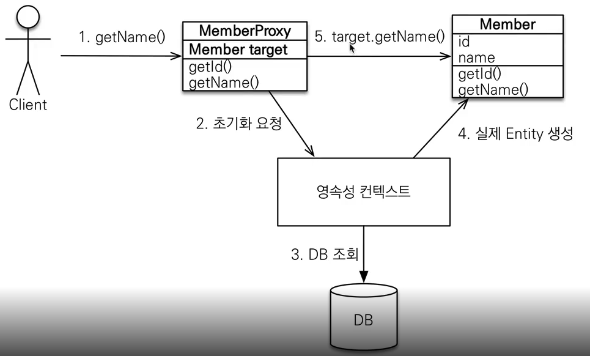

# 프록시와 연관관계 관리
---
### __1. 프록시__

- em.find() vs em.getReference()
	- em.find() : 실제 데이터베이스에 쿼리를 날려 실제 엔티티 객체 조회
	- em.getReference() : 데이터베이스 조회를 미루는 가짜(프록시) 엔티티 객체 조회
<br>
- em.find()를 호출하면 em.find()가 호출되는 시점에 실제로 DB에 쿼리가 날아가지만 em.getReference() 를 호출했을때는 실제로 값이 사용되는 시점에 쿼리가 날아간다. 


<br><br>

- 프록시의 특징
	- 프록시 객체는 처음 사용할 때 한번만 초기화한다.
	- 프록시 객체를 초기화할때, 프록시 객체가 실제 엔티티로 바뀌는것이 아니다.<br>
	초기화되면 프록시 객체를 통해서 실제 엔티티에 접근 가능하다.
	- 프록시 객체는 원본 엔티티를 상속받는다. 따라서 == 비교 대신 instance of로 사용해야한다.
	- 영속성 컨텍스트에 엔티티가 이미 담겨 있다면 em.getReference()를 호출해도 실제 엔티티가 반환된다.
<br>

- 프록시 확인
	- 프록시 인스턴스의 초기화 여부 확인<br>
	emf.getPersistenceUnitUtil.isLoaded(Object entity)
	- 프록시 강제 초기화<br>
	Hibernate.initialize(entity);

<br>

### __2. 즉시 로딩과 지연 로딩__

[즉시로딩]
- 여러 Entity의 값이 같이 필요할경우 Join하여 다른 객체의 값까지 모두 불러온다.
- 다 불러오기 때문에 프록시가 필요없음.
- 실무에서는 사용하면 안된다. 지연로딩만 사용!
<br>
why? 즉시로딩을 적용하면 예상하지 못한 SQL이 발생, JPQL에서 N + 1 문제가 발생
<br>
- @ManyToOne, @OneToOne 은 디폴트가 즉시로딩으로 설정되어있다.
<br>그렇기에 꼭 LAZY로 변경해주어야한다!

ex) 
```java
@Entity
public class Member{

@ManyToOne(fetch = FetchType.EAGER)
@JoinColumn
private Team team;

}
```

[지연로딩]
- 여러 Entity가 연관되어있을경우 하나의 Entity 정보만 필요할때 모든 객체의 정보를 다 불러오면 비효율적이다.
- 이럴때 LAZY를 사용하여 호출하면 사용되지 않는 엔티티는 프록시로 가져온다.<br>(실제 Team 객체의 메소드를 호출하는 시점에 초기화된다.)

ex) 
```java
@Entity
public class Member{

@ManyToOne(fetch = FetchType.LAZY)
@JoinColumn
private Team team;

}
```
<br>

### __3. 영속성 전이(CASCADE)__
- 특정 엔티티를 영속 상태로 만들때 연관된 엔티티도 함께 영속 상태로 만드는것
<br> ex) 부모 엔티티를 저장할 때 자식 엔티티도 함께 저장한다.
<br> em.persist(parent) 할 때 cascade 선언한 컬렉션안에 들어있는 엔티티도 모두 날아간다( em.persist(child) ).

<br>

- 사용하는 경우
	- 하나의 부모만 그 Entity를 관리하는 경우 and 부모 Entity와 라이프 사이클이 같을때 -- 등록, 삭제
- 사용하면 안되는 경우
	- 자식을 여러 Entity에서 관리하는 경우

ex) 
```java
@Entity
public class Parent{

@OneToMany(mappedBy = "parent", cascade = CascadeType.ALL)
private List<Child> childList = new ArrayList<>();

}
```
<br>

### __4. 고아 객체(orphanRemoval)__
- 부모 엔티티와 연관관계가 끊어진 자식 엔티티를 자동으로 삭제한다.
- 사용하는 경우
	- 참조하는곳이 하나일 경우
	- 특정 엔티티가 개인 소유할때

ex) 
```java
@Entity
public class Parent{

@OneToMany(mappedBy = "parent", cascade = CascadeType.ALL, orphanRemoval = true)
private List<Child> childList = new ArrayList<>();

}

/* Main */

Parent findParent = em.find(Parent.class, parent.getId());
findParent.getChildList().remove(0);
// em.remove(findParent); 
```

--> 0 번에 해당하는, findParent에 해당하는 자식 엔티티 자동 삭제
<br>
--> cascade remove 와 비슷하게 작동한다.
<br>
- cascade = CascadeType.ALL, orphanRemoval = true 를 모두 사용하면 자식의 생명주기를 관리 할 수 있다(DAO, REPOSITORY 미사용 가능)
- 도메인 주도 설계(DDD)의 Aggregate Root 개념을 구현할때 유용하다.

<br><br><br><br><br>
[참고] 인프런 - 자바 ORM 표준 JPA 프로그래밍